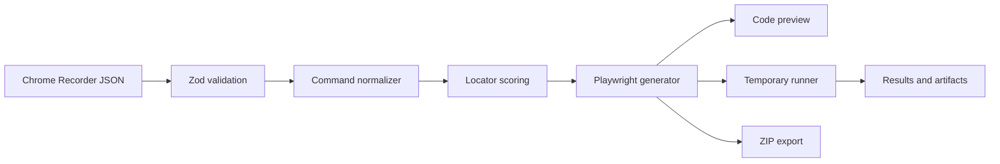

# TestPilot

TestPilot converts Chrome Recorder journeys into structured Playwright projects. It normalizes browser commands, scores locator quality, protects sensitive values, generates Page Objects, executes tests locally, and exposes screenshots, videos, and traces from failed runs.

## Core workflow

1. Import a Chrome Recorder JSON file or use the built-in checkout journey.
2. Review the normalized command map and choose preferred locator alternatives.
3. Inspect the generated test, Page Object, configuration, and environment template.
4. Run the journey in local Chromium.
5. Export the complete Playwright project as a ZIP archive.

## Stack

- React 19, TypeScript, Vite 8
- Express 5 and Zod
- Playwright Test
- Vitest and Oxlint
- Archiver for streamed project exports

## Start locally

Prerequisites: Node.js 20 or newer and npm.

```bash
npm install
npx playwright install chromium
npm run dev
```

Open `http://localhost:5173`. The local execution API listens on `http://127.0.0.1:8787` and is proxied by Vite.

## Commands

```bash
npm run dev       # Start the Vite client and Express API
npm run demo      # Print the deterministic portfolio demo in the terminal
npm test          # Run parser, generator, and API tests
npm run lint      # Run Oxlint
npm run build     # Type-check all projects and build the client
npm start         # Serve the production build and API on port 8787
```

## Architecture



The browser and API share the same pure generator, so previewed and executed code cannot drift. Live runs are written under `.testpilot-runs`, limited to 210 seconds, and pruned to the 12 most recent directories. Navigation is restricted to HTTP and HTTPS URLs, and protected input values are replaced with `TESTPILOT_SECRET` in generated source.

Imported recordings default to an explicit deterministic simulation unless they contain `"executionMode": "live"`. Demo runs print `[RUN]` and `[PASS]` messages for every normalized action and always pass without contacting external websites. Duration scales with command count and generated code size from a 15-second minimum to a 55-second maximum. This mode is intended for repeatable portfolio presentations; set the property to `"live"` to run the generated Playwright test against the real site.

## Sample recording

The built-in sample points to the included `/demo-store` route and automatically uses the current browser origin. A static import fixture is also available at `public/sample-recording.json` for the default Vite port.
